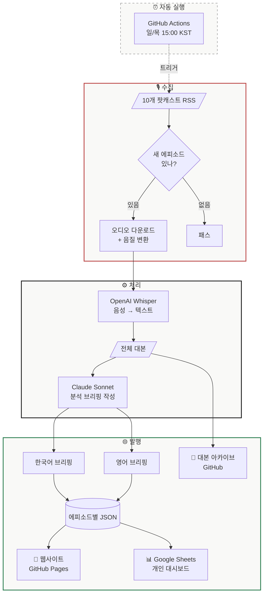

<div align="center">

# Podcast Briefing

**매주 들을 수 없는 팟캐스트, AI가 대신 정리해드립니다**

[사이트 바로가기](https://lowtidebuild.github.io/podcast-briefing/) | [English README](README.md)

<br>

*거시경제부터 AI, 지정학, 정책까지 — 10개 팟캐스트의 핵심을*
*한국어/영어 분석 브리핑으로 읽어보세요.*

</div>

---

## 이게 뭔가요

매주 쏟아지는 영어 팟캐스트를 일일이 듣기엔 시간이 부족합니다. 이 프로젝트는 10개 엄선된 팟캐스트의 새 에피소드를 자동으로 감지하고, 음성을 텍스트로 변환한 뒤, AI가 "이 에피소드 왜 들어야 해?"에 답하는 분석 브리핑을 만들어줍니다. 한국어와 영어 동시에.

단순 요약이 아닙니다. 핵심 주장이 뭔지, 근거가 뭔지, 그래서 우리한테 뭘 의미하는지 — The Economist 기사처럼 구조화된 분석입니다.

## 어떤 팟캐스트를 다루나요

겹치지 않는 10개 소스로, 세계를 읽는 데 필요한 핵심 영역을 커버합니다.

| 팟캐스트 | 다루는 주제 | 주기 |
|---------|-----------|------|
| **Odd Lots** (Bloomberg) | 거시경제, 금융시장 | 주 2-3회 |
| **Dwarkesh Podcast** | AI, 기술 심층 대화 | 격주 |
| **Lex Fridman Podcast** | AI, 과학, 철학 | 격주 |
| **Fareed Zakaria GPS** (CNN) | 지정학, 국제관계 | 주 1회 |
| **Hard Fork** (NYT) | 테크, AI 시사 이슈 | 주 1회 |
| **a16z Podcast** | VC, 테크 비즈니스 | 주 2-3회 |
| **Ezra Klein Show** (NYT) | 정치, 정책, 철학 | 주 1-2회 |
| **All-In Podcast** | 테크 × 정치 × 경제 | 주 1-2회 |
| **Exponential View** | AI × 에너지 × 지정학 | 주 1회 |
| **Making Sense** (Sam Harris) | 철학, AI 윤리 | 격주 |

## 어떻게 돌아가나요



**일요일과 목요일 오후 3시(KST)** 에 자동으로 돌아갑니다:

1. **감지** — 10개 RSS 피드에서 새 에피소드 확인
2. **전사** — 오디오를 받아 텍스트로 변환 (OpenAI Whisper)
3. **분석** — Claude가 한/영 브리핑 작성. 핵심 주장, 인용문, 게스트 정보까지 추출
4. **발행** — 웹사이트 업데이트 + Google Sheet 기록 + 대본 저장

## 프로젝트 구조

```
podcast-briefing/
├── pipeline/              # 수집 → 전사 → 분석 → 저장
│   ├── fetch_feeds.py     # RSS에서 새 에피소드 찾기
│   ├── download_audio.py  # 오디오 다운로드 + 변환
│   ├── transcribe.py      # 음성 → 텍스트 (Whisper)
│   ├── summarize.py       # 분석 브리핑 생성 (Claude)
│   ├── generate_output.py # JSON 파일 생성
│   ├── sheets.py          # Google Sheets 연동
│   └── main.py            # 전체 흐름 관리
├── web/                   # 웹사이트 (Astro)
│   └── src/
│       ├── pages/         # 메인 (최근 7일) + 아카이브 (전체)
│       ├── components/    # 에피소드 카드, 필터, 토글 등
│       └── styles/        # 디자인 시스템
├── config/feeds.yaml      # 팟캐스트 목록 설정
├── data/
│   ├── summaries/         # 에피소드별 브리핑 JSON
│   ├── transcripts/       # 전체 대본 텍스트
│   └── state.json         # 이미 처리한 에피소드 기록
└── .github/workflows/     # 자동 실행 설정
```

## 디자인에 대해

인쇄 매체의 전통을 가져왔습니다. 화려함보다 절제.

**글꼴** — 본문은 Georgia 세리프. UI는 시스템 산세리프. 외부 폰트 없이도 격식 있는 느낌을 만듭니다.

**여백** — 720px 한 줄 읽기. 에피소드 사이 56px, 카드 안 40px. 빽빽하지 않게, 콘텐츠가 숨 쉬게.

**색상** — 배경 #fafaf8 (거의 흰색), 텍스트 #1a1a1a (거의 검정), 강조 #b44 (빨강) 딱 하나. 카테고리 라벨과 인용문에만 씁니다.

**카드 구조** — 위에서 아래로: `카테고리 → 제목 → 출처/날짜 → 게스트 → 요약 → 키포인트 → 인용문 → 키워드 → 액션 바`. 읽는 흐름을 방해하는 버튼은 없습니다. 유틸리티(원본 링크, 대본 복사, 다운로드)는 카드 맨 아래에.

**모바일** — 데스크톱을 그냥 세로로 쌓은 게 아닙니다. 액션 바는 세로 배치, 터치 영역 44px 확보, 필터는 가로 스크롤.

## 주요 기능

**한/영 분석 브리핑** — 한국어(합니다 체)와 영어. 토글 버튼 한 번이면 전환.

**"So what?" 프레이밍** — 모든 브리핑은 "이걸 왜 읽어야 하는데?"에서 시작합니다. 키포인트 제목도 토픽이 아니라 주장입니다.

> 나쁜 예: "AI 에이전트 시장"
> 좋은 예: "기업 AI 파일럿의 90%가 실패한다 — 기술이 아니라 조직이 병목"

**게스트 자동 식별** — 대본에서 게스트 이름과 소속을 뽑아 카드에 표시합니다.

**대본 활용** — 클립보드 복사(NotebookLM에 붙여넣기용)나 Obsidian .md 다운로드가 가능합니다.

**Google Sheets 대시보드** — 에피소드마다 자동으로 시트에 기록. 별점, 읽음 표시, 메모를 직접 달 수 있습니다. 요약 생성에 실패하면 ⚠️ 표시가 뜹니다.

**아카이브** — 메인은 최근 7일만. 전체는 아카이브에서 주 단위로 정리.

**카테고리 필터** — 버튼 하나로 Macro, AI/Tech, Politics 등 원하는 분야만.

**소스 목록** — 헤더의 "10 Sources ▾"를 누르면 펼쳐집니다. 모달 아니고, JavaScript도 안 씁니다.

## 한국어 표기 원칙

정확성을 위해 고유명사는 영어 그대로 씁니다.

| 종류 | 이렇게 | 이렇게 안 함 |
|------|--------|------------|
| 사람 이름 | Torsten Sløk | ~~토르스텐 슬뢰크~~ |
| 기업/기관 | Apollo, Federal Reserve | ~~아폴로~~, ~~연방준비제도~~ |
| 전문 용어 | term premium, NIMBYism | 정착된 번역이 없으면 영어 유지 |
| 인용 출처 | Jenny Schuetz, Brookings | 항상 영어 |

## 시작하기

1. 리포 클론
2. GitHub Secrets 설정: `OPENAI_API_KEY`, `ANTHROPIC_API_KEY`
3. (선택) `GOOGLE_SHEETS_CREDENTIALS` + `GOOGLE_SHEET_ID` — Sheets 대시보드용
4. `config/feeds.yaml`에서 원하는 소스로 수정
5. Push하면 끝 — 나머지는 GitHub Actions가 알아서 합니다

## 로컬에서 돌려보기

```bash
# 웹사이트 개발 서버
cd web && npm install && npm run dev

# 파이프라인 직접 실행 (API 키 환경변수 필요)
pip install -r requirements.txt
python pipeline/main.py
```

## 소스 추가하기

`config/feeds.yaml`에 한 블록 추가하면 됩니다. 코드 수정 필요 없어요.

```yaml
  - name: "새 팟캐스트"
    display_category: "카테고리"
    homepage: "https://example.com"
    rss: "https://example.com/feed.rss"
    frequency: "weekly"
    transcript_source: "whisper"
```

## 라이선스

[Apache License 2.0](LICENSE) 하에 배포됩니다.

---

<div align="center">

[Astro](https://astro.build) · [Claude](https://anthropic.com) · [OpenAI Whisper](https://openai.com)

The Economist처럼 읽히는 팟캐스트 브리핑

</div>
